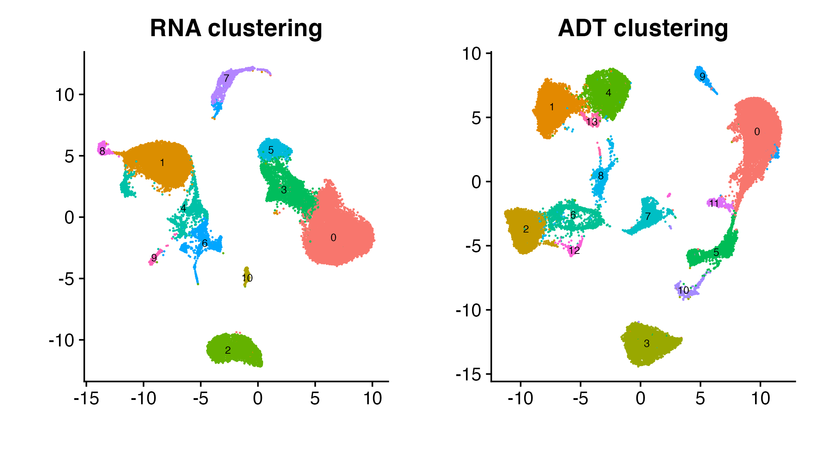
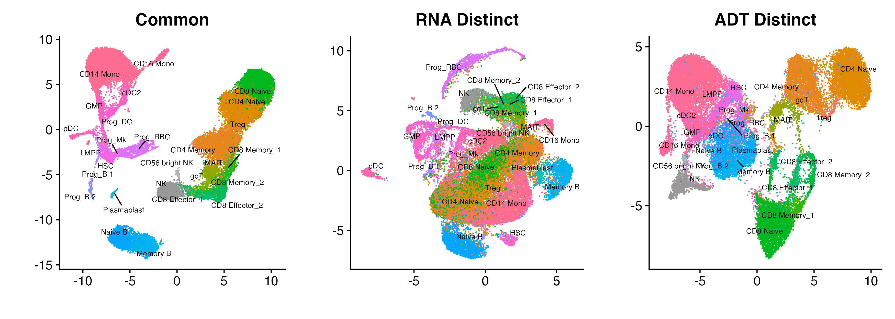

# Analysis of CITE-seq

``` r
library(cowplot)
library(Seurat)
library(SeuratData)
library(tiltedCCA)
library(MASS)
set.seed(10)
```

We go through how to analyze single-cell multiomic data in this vignette
(RNA and Protein, via surface antibody markers). We focus on the
CITE-seq data, which comes directly from the `SeuratData` package. (In
fact, this dataset is showcased in
<https://satijalab.org/seurat/articles/weighted_nearest_neighbor_analysis>.)

## Preliminary analysis

### Installing and loading the data

To install the data, uncomment the `SeuratData::InstallData("bmcite")`
line.

``` r
# SeuratData::InstallData("bmcite")
bm <- SeuratData::LoadData(ds = "bmcite")
```

This load in a dataset which 30,672 cells. In the RNA modality, there
are 17,009 genes. In the ADT modality, there are 25 surface antibody
markers.

### Basic preprocessing of the data

We first preprocess the RNA modality. This results in 2000 highly
variable genes, and the PCA of the RNA modality is stored in the `pca`
slot.

``` r
Seurat::DefaultAssay(bm) <- 'RNA'
bm <- Seurat::NormalizeData(bm)
bm <- Seurat::FindVariableFeatures(bm) 
bm <- Seurat::ScaleData(bm) 
bm <- Seurat::RunPCA(bm, 
                     verbose = F)
```

Next, we preprocess the ADT modality. We treat all 25 surface antibody
markers as the highly variable genes, and the PCA of the RNA modality is
stored in the `apca` slot.

``` r
Seurat::DefaultAssay(bm) <- 'ADT'
Seurat::VariableFeatures(bm) <- rownames(bm[["ADT"]])
bm <- Seurat::NormalizeData(bm, 
                            normalization.method = 'CLR', 
                            margin = 2)
bm <- Seurat::ScaleData(bm) 
bm <- Seurat::RunPCA(bm, 
                     npcs = 18, 
                     reduction.name = 'apca', 
                     verbose = F)
```

### Basic analysis of the data

To illustrate what WNN does (which illustrates the “union of
information”), we can also run WNN on this dataset.

``` r
set.seed(10)
bm <- Seurat::FindMultiModalNeighbors(
  bm, 
  reduction.list = list("pca", "apca"), 
  dims.list = list(1:30, 1:18), 
  modality.weight.name = "RNA.weight"
)
```

Now, we are ready to visualize the data. To do this, we run three
different UMAPS, one for RNA, one for ADT, and one for the WNN (which
combines both the RNA and ADT modality). These are stored as `rna.umap`,
`adt.umap`, and `wnn.umap` respectively.

``` r
set.seed(10)
bm <- Seurat::RunUMAP(bm, 
                      reduction = 'pca', 
                      dims = 1:30, assay = 'RNA',
                      reduction.name = 'rna.umap', 
                      reduction.key = 'rnaUMAP_')
set.seed(10)
bm <- Seurat::RunUMAP(bm, 
                      reduction = 'apca', 
                      dims = 1:18, assay = 'ADT',
                      reduction.name = 'adt.umap', 
                      reduction.key = 'adtUMAP_')
set.seed(10)
bm <- Seurat::RunUMAP(bm,
                      nn.name = "weighted.nn", 
                      reduction.name = "wnn.umap", 
                      reduction.key = "wnnUMAP_")
```

We are now ready to plot the data. We first need to set up an
appropriate color palette.

``` r
col_palette <- c(
  "CD14 Mono" = rgb(255, 108, 145, maxColorValue = 255),
  "CD16 Mono" = rgb(255, 104, 159, maxColorValue = 255),
  "CD4 Memory" = rgb(231, 134, 26, maxColorValue = 255),
  "CD4 Naive"= rgb(224, 139, 0, maxColorValue = 255),
  "CD56 bright NK" = rgb(0.7, 0.7, 0.7),
  "CD8 Effector_1" = rgb(2, 190, 108, maxColorValue = 255),
  "CD8 Effector_2" = rgb(0, 188, 89, maxColorValue = 255),
  "CD8 Memory_1" = rgb(57, 182, 0, maxColorValue = 255),
  "CD8 Memory_2" = rgb(0, 186, 66, maxColorValue = 255),
  "CD8 Naive" = rgb(1, 184, 31, maxColorValue = 255),
  "cDC2" = rgb(255, 98, 188, maxColorValue = 255),
  "gdT" = rgb(133, 173, 0, maxColorValue = 255),
  "GMP" = rgb(255, 97, 201, maxColorValue = 255),
  "HSC" = rgb(247, 99, 224, maxColorValue = 255),
  "LMPP" = rgb(240, 102, 234, maxColorValue = 255),
  "MAIT" = rgb(149, 169, 0, maxColorValue = 255),
  "Memory B" = rgb(0, 180, 239, maxColorValue = 255),
  "Naive B" = rgb(2, 165, 255, maxColorValue = 255),
  "NK" = rgb(0.6, 0.6, 0.6),
  "pDC" = rgb(255, 101, 174, maxColorValue = 255),
  "Plasmablast" = rgb(1, 191, 196, maxColorValue = 255),
  "Prog_B 1" = rgb(172, 136, 255, maxColorValue = 255),
  "Prog_B 2" = rgb(121, 151, 255, maxColorValue = 255),
  "Prog_DC" = rgb(252, 97, 213, maxColorValue = 255),
  "Prog_Mk" = rgb(231, 107, 243, maxColorValue = 255),
  "Prog_RBC" = rgb(220, 113, 250, maxColorValue = 255),
  "Treg" = rgb(243, 123, 89, maxColorValue = 255)
)

p1 <- Seurat::DimPlot(bm, 
                      reduction = "rna.umap",
                      group.by = "celltype.l2", 
                      cols = col_palette, 
                      label = T, repel = T, label.size = 2.5)
p1 <- p1 + Seurat::NoLegend()
p1 <- p1 + ggplot2::ggtitle("RNA") + ggplot2::labs(x = "", y = "")
p1 <- p1 + ggplot2::theme(legend.text = ggplot2::element_text(size = 5))

p2 <- Seurat::DimPlot(bm, 
                      reduction = "adt.umap",
                      group.by = "celltype.l2", 
                      cols = col_palette, 
                      label = T, repel = T, label.size = 2.5)
p2 <- p2 + Seurat::NoLegend()
p2 <- p2 + ggplot2::ggtitle("ADT") + ggplot2::labs(x = "", y = "")
p2 <- p2 + ggplot2::theme(legend.text = ggplot2::element_text(size = 5))

p3 <- Seurat::DimPlot(bm, 
                      reduction = "wnn.umap",
                      group.by = "celltype.l2", 
                      cols = col_palette, 
                      label = T, repel = T, label.size = 2.5)
p3 <- p3 + Seurat::NoLegend()
p3 <- p3 + ggplot2::ggtitle("WNN") + ggplot2::labs(x = "", y = "")
p3 <- p3 + ggplot2::theme(legend.text = ggplot2::element_text(size = 5))

p_all <- cowplot::plot_grid(p1, p2, p3, ncol = 3)
p_all
```


UMAPs of the RNA modality (left), ADT modality (middle), or WNN (right,
which combines the information in the RNA and ADT)

## Running Tilted-CCA

We are now ready to run Tilted-CCA.

### Hard clustering the cells

Based on the visualizations, we assess that there is obvious clustering
structure in the data (which we could’ve assessed if the data did not
have cell type labels). Hence, we would like to pass “hard clusters”
(one clustering for each modality) into Tilted-CCA to get more
informative common and distinct embeddings. This results in 11 clusters
for the RNA modality, and 14 communities for the ADT modality.

``` r
Seurat::DefaultAssay(bm) <- "RNA"
set.seed(10)
bm <- Seurat::FindNeighbors(bm, dims = 1:30)
bm <- Seurat::FindClusters(bm, resolution = 0.25)

Seurat::DefaultAssay(bm) <- "ADT"
set.seed(10)
bm <- Seurat::FindNeighbors(bm, dims = 1:18, reduction = "apca")
bm <- Seurat::FindClusters(bm, resolution = 0.25)
```

We can plot the clusters. This is a way to assess if the clustering from
each modality is appropriate prior to using Tilted-CCA.

``` r
p1 <- Seurat::DimPlot(bm, 
                      reduction = "rna.umap",
                      group.by = "RNA_snn_res.0.25", 
                      label = TRUE, label.size = 2.5)
p1 <- p1 + Seurat::NoLegend() + ggplot2::labs(x = "", y = "")
p1 <- p1 + ggplot2::ggtitle("RNA clustering")
p1 <- p1 + ggplot2::theme(legend.text = ggplot2::element_text(size = 5))

p2 <- Seurat::DimPlot(bm, 
                      reduction = "adt.umap",
                      group.by = "ADT_snn_res.0.25", 
                      label = TRUE, label.size = 2.5)
p2 <- p2 + Seurat::NoLegend() + ggplot2::labs(x = "", y = "")
p2 <- p2 + ggplot2::ggtitle("ADT clustering")
p2 <- p2 + ggplot2::theme(legend.text = ggplot2::element_text(size = 5))

p_all <- cowplot::plot_grid(p1, p2, ncol = 2)
p_all
```



Modality-specific clustering structure

Note: These two clusters are *not* the same. The colorings in each of
the two above plots are *not* related.

### Extracting the relevant matrices

We now extract the relevant matrices for Tilted-CCA. Since Tilted-CCA is
designed not necessarily for single-cell data, we don’t pass the Seurat
object directly into Tilted-CCA. Instead, we extract the relevant
matrices, where the rows are the cells and the columns are various
features (i.e., genes and antibodies). We also remove features that has
negligible empirical standard deviation. (In this tutorial, no genes or
antibodies were removed in this step.) We end up with `mat_1b` that has
30,672 cells and 2000 genes, and `mat_2b` that has the same 30,672 cells
and 25 surface antibody markers.

``` r
Seurat::DefaultAssay(bm) <- "RNA"
mat_1 <- Matrix::t(bm[["RNA"]]@data[Seurat::VariableFeatures(object = bm),])
Seurat::DefaultAssay(bm) <- "ADT"
mat_2 <- Matrix::t(bm[["ADT"]]@data)

mat_1b <- mat_1
sd_vec <- sparseMatrixStats::colSds(mat_1b)
if(any(sd_vec <= 1e-6)){
  mat_1b <- mat_1b[,-which(sd_vec <= 1e-6)]
}

mat_2b <- mat_2
sd_vec <- sparseMatrixStats::colSds(mat_2b)
if(any(sd_vec <= 1e-6)){
  mat_2b <- mat_2b[,-which(sd_vec <= 1e-6)]
}
```

### Running Tilted-CCA

We start Tilted-CCA by first preparing all the low-dimensional
embeddings via
[`tiltedCCA::create_multiSVD`](https://linnykos.github.io/tiltedCCA/reference/create_multiSVD.md).
Most of the boolean arguments are meant to tell our method on whether or
not features are centered and/or scaled (or alternatively, the singular
vectors are centered and/or scaled). We would recommend the boolean
parameters here for any single-cell multiomic data that measures RNA and
antibodies.

``` r
set.seed(10)
multiSVD_obj <- tiltedCCA::create_multiSVD(mat_1 = mat_1b, mat_2 = mat_2b,
                                           dims_1 = 1:30, dims_2 = 1:18,
                                           center_1 = T, center_2 = T,
                                           normalize_row = T,
                                           normalize_singular_value = T,
                                           recenter_1 = F, recenter_2 = F,
                                           rescale_1 = F, rescale_2 = F,
                                           scale_1 = T, scale_2 = T,
                                           verbose = 1)
```

We then pass in the clusterings (one for the RNA, one for the ADT) as
well as form metacells via
[`tiltedCCA::form_metacells`](https://linnykos.github.io/tiltedCCA/reference/form_metacells.md).
The metacells help speed up all the later Tilted-CCA calculations. In
general, we recommend using 5000 metacells if the number of cells is
dramatically larger than 5000.

``` r
multiSVD_obj <- tiltedCCA::form_metacells(input_obj = multiSVD_obj,
                                          large_clustering_1 = as.factor(bm$RNA_snn_res.0.25), 
                                          large_clustering_2 = as.factor(bm$ADT_snn_res.0.25), 
                                          num_metacells = 5000,
                                          verbose = 1)
```

This next step, using
[`tiltedCCA::compute_snns`](https://linnykos.github.io/tiltedCCA/reference/compute_snns.md),
is arguably the most subjective step of Tilted-CCA, but nonetheless can
dramatically impact the results if not chosen with care. Here:

- `latent_k` dictates how many latent dimensions are extracted from the
  Laplacian bases of the shared nearest neighbor graphs
- `num_neigh` dictates how many nearest neighbors are used for each cell
  when constructing the nearest neighbor graphs
- `bool_cosine` dictates if distance between cells is based on the
  cosine distance (if `TRUE`, i.e., Euclidean distance after normalizing
  each gene’s low-dimensional embedding to have Euclidean length 1) or
  Euclidean distance (if `FALSE`)
- `bool_intersect` dictates if an edge is placed between two cells only
  if each cell is a nearest neighbor of the other cell (if `TRUE`) or if
  an edge is placed between two cells as long as one cell is a nearest
  neighbor of the other cell (if `FALSE`)
- `min_deg` dictates the smallest number of edges for each cell (which
  is only relevant if `bool_intersect=TRUE`), and this value should be a
  value smaller or equal to `num_neigh`

``` r
multiSVD_obj <- tiltedCCA::compute_snns(input_obj = multiSVD_obj,
                                        latent_k = 20,
                                        num_neigh = 30,
                                        bool_cosine = T,
                                        bool_intersect = F,
                                        min_deg = 30,
                                        verbose = 2)
```

Then, we initialize the tilt for all 18 latent dimensions (i.e., the
minimum between the number of latent dimensions in `dims_1` and
`dims_2`) via
[`tiltedCCA::tiltedCCA`](https://linnykos.github.io/tiltedCCA/reference/tiltedCCA.md).

``` r
multiSVD_obj <- tiltedCCA::tiltedCCA(input_obj = multiSVD_obj,
                                     verbose = 1)
```

Finally, we fine tune the tilt of each latent dimension. This step can
take a while. On a 2020 Macbook Pro (Big Sur, with a Quad-Core Intel
Core i7), this step takes around 20 minutes.

``` r
multiSVD_obj <- tiltedCCA::fine_tuning(input_obj = multiSVD_obj,
                                       verbose = 1)
```

After running `tiltedCCA:fine_tuning`, it is recommended to save
`multiSVD_obj` since this was the most expensive calculation (in terms
of computation time). The last function call simply takes the tilts of
each latent dimension to compute the full decomposition of each modality
(i.e., cell by feature matrix), four in total (i.e., a common and
distinct for each RNA and ADT). While this function doesn’t take too
much computation time, it greatly expands the memory size of the
`multiSVD_obj` object.

``` r
multiSVD_obj <- tiltedCCA::tiltedCCA_decomposition(input_obj = multiSVD_obj,
                                                   verbose = 1)
```

## Downstream analysis of Tilted-CCA

Congratulations! You have computed the common and distinct embeddings
for the single-cell multiomic data. There are various downstream
diagnostics you can apply.

### Visualizing the common and distinct embeddings

``` r
set.seed(10)
bm[["common_tcca"]] <- tiltedCCA::create_SeuratDim(input_obj = multiSVD_obj,
                                                   what = "common",
                                                   aligned_umap_assay = "rna.umap",
                                                   seurat_obj = bm,
                                                   seurat_assay = "RNA",
                                                   verbose = 1)
set.seed(10)
bm[["distinct1_tcca"]] <- tiltedCCA::create_SeuratDim(input_obj = multiSVD_obj,
                                                      what = "distinct_1",
                                                      aligned_umap_assay = "rna.umap",
                                                      seurat_obj = bm,
                                                      seurat_assay = "RNA",
                                                      verbose = 1)
set.seed(10)
bm[["distinct2_tcca"]] <- tiltedCCA::create_SeuratDim(input_obj = multiSVD_obj,
                                                      what = "distinct_2",
                                                      aligned_umap_assay = "rna.umap",
                                                      seurat_obj = bm,
                                                      seurat_assay = "RNA",
                                                      verbose = 1)
```

We can now plot all three embeddings. Observe how in the common
embedding, all the major cell types such as B cells (blue), T cells
(mustard, green, and gray) and Monocytes/DC (pink) are separate from one
another. This is because both the RNA and ADT modality exhibit these
large separation structures. However, because the RNA modality does not
cleanly separate the CD8 T-cells from the CD4 T-cells (which only the
ADT modality does), there is no apparent separation between these two
T-cell sub-types in the common embedding. The RNA distinct embedding
displays further separation of the Monocytes/DC, while the ADT distinct
embedding displays further separation of the CD8 T-cells from the CD4
T-cells (green and mustard respectively).

``` r
p1 <- Seurat::DimPlot(bm, 
                      reduction = "common_tcca",
                      group.by = "celltype.l2", 
                      cols = col_palette, 
                      label = T, repel = T, label.size = 2.5)
p1 <- p1 + Seurat::NoLegend()
p1 <- p1 + ggplot2::ggtitle("Common") + ggplot2::labs(x = "", y = "")
p1 <- p1 + ggplot2::theme(legend.text = ggplot2::element_text(size = 5))

p2 <- Seurat::DimPlot(bm, 
                      reduction = "distinct1_tcca",
                      group.by = "celltype.l2", 
                      cols = col_palette, 
                      label = T, repel = T, label.size = 2.5)
p2 <- p2 + Seurat::NoLegend()
p2 <- p2 + ggplot2::ggtitle("RNA Distinct") + ggplot2::labs(x = "", y = "")
p2 <- p2 + ggplot2::theme(legend.text = ggplot2::element_text(size = 5))

p3 <- Seurat::DimPlot(bm, 
                      reduction = "distinct2_tcca",
                      group.by = "celltype.l2", 
                      cols = col_palette, 
                      label = T, repel = T, label.size = 2.5)
p3 <- p3 + Seurat::NoLegend()
p3 <- p3 + ggplot2::ggtitle("ADT Distinct") + ggplot2::labs(x = "", y = "")
p3 <- p3 + ggplot2::theme(legend.text = ggplot2::element_text(size = 5))

p_all <- cowplot::plot_grid(p1, p2, p3, ncol = 3)
p_all
```



Common, RNA distinct, and ADT distinct embeddings

### Assessing how enriched each cell type is in the common or distinct embeddings

Equipped with the common and distinct embeddings, we can more formally
quantify our visual interprations from above. Specifically, we can
compute the percentage of cell types near each cell. If a cell is
“enriched” in a particular embedding (for example, the RNA distinct
embedding), this means that most of the nearest neighbors of that cell
have the same cell type. We perform these calculations using the
[`tiltedCCA::postprocess_cell_enrichment`](https://linnykos.github.io/tiltedCCA/reference/postprocess_cell_enrichment.md)
function. This takes about 5 minutes.

``` r
membership_vec <- factor(bm$celltype.l2)
cell_enrichment_res <- tiltedCCA::postprocess_cell_enrichment(
  input_obj = multiSVD_obj, 
  membership_vec = membership_vec, 
  max_subsample = 1000,
  verbose = 1
)
```

We can then visualize these cell-type enrichments. Observe that in the
left plot, the values go from 1 to 0 (along the x-axis), while in the
right plot, the values go from 0 to 1 (along the x-axis). To read this
plot, each cell type is represented as a dot (with color in
`col_palette`). The higher a cell type is on the y-axis, the more it
means that a cell type’s separation from all other cell types is
supported by both modalities. The more a cell type is to the extremes of
the plot (i.e., a value of 1 on either of the x-axis), the more it means
there is extra information in that modality that separates that cell
type from other cell types that is not reflect in the other modality.
The y-axis value for each cell type is the same in each plot.

``` r
tiltedCCA::plot_cell_enrichment(cell_enrichment_res,
                                col_palette = col_palette,
                                cex_axis = 1.25,
                                cex_lab = 1.5,
                                xlab_1 = "RNA Distinct",
                                xlab_2 = "ADT Distinct")
```


Cell type enrichment of common vs. distinct

### Assessing the alignment of each gene with the common embedding

We now strive to assess how aligned each gene is with the common
embedding, relative to how “important” the gene is in separating the
cell types apart. We run the following code to simplify number of cell
types to consider, because in what’s to come, we will be running a
differential-expression (DE) test between each pair of cell types.

``` r
celltype_l3 <- as.character(bm$celltype.l2)
celltype_l3[celltype_l3 %in% c("NK", "CD56 bright NK")] <- "NK_all"
celltype_l3[celltype_l3 %in% c("MAIT", "gdT")] <- "MAIT-gdT"
celltype_l3[celltype_l3 %in% c("Memory B", "Naive B")] <- "B"
celltype_l3[celltype_l3 %in% c("Prog_B 1", "Prog_B 2")] <- "Prog_B"
celltype_l3[celltype_l3 %in% c("Prog_Mk", "Plasmablast", "LMPP", "Treg")] <- NA
col_palette2 <- c(col_palette, 
                  col_palette["NK"], 
                  col_palette["MAIT"], 
                  col_palette["Memory B"], 
                  col_palette["Prog_B 1"])
names(col_palette2) <- c(names(col_palette), "NK_all", "MAIT-gdT", "B", "Prog_B")
```

Since there are 19 different cell types, there are 171 pairwise
comparisons to make. This would be too many comparisons for a short
tutorial. Hence, if you do not currently have time to run a multi-hour
computation, please run the following line. This subsets the cell types
to be only 4.

``` r
# RECOMMEND: For a short tutorial, please run this line 
keep_celltypes <- c("CD4 Naive", "CD8 Naive", "B", "CD14 Mono")
celltype_l3[!celltype_l3 %in% keep_celltypes] <- NA
```

As long as `celltype_l3` only has 4 cell types, this following
calculation would take only 20 minutes (again, on a 2020 Macbook Pro,
Big Sur, with a Quad-Core Intel Core i7). The result is a vector
`logpval_vec`, which contains the negative log10 p-value for each of the
2000 highly variable genes. Please see the documentation for
[`tiltedCCA::differential_expression`](https://linnykos.github.io/tiltedCCA/reference/differential_expression.md)
on how exactly this p-value was derived.

``` r
bm$celltype.l3 <- celltype_l3
gene_de_list <- tiltedCCA::differential_expression(seurat_obj = bm,
                                                   assay = "RNA",
                                                   idents = "celltype.l3",
                                                   test_use = "MAST",
                                                   slot = "counts")

logpval_vec <- tiltedCCA::postprocess_depvalue(de_list = gene_de_list, 
                                               maximum_output = 300)
```

The former calculation tells us how “important” a gene is in separating
the cell types apart. We now need to compute how aligned a gene is with
the common embedding. This is what we do with the
[`tiltedCCA::postprocess_modality_alignment`](https://linnykos.github.io/tiltedCCA/reference/postprocess_modality_alignment.md)
function.

``` r
rsquare_vec <- tiltedCCA::postprocess_modality_alignment(input_obj = multiSVD_obj,
                                                         bool_use_denoised = T,
                                                         seurat_obj = bm,
                                                         input_assay = 1,
                                                         seurat_assay = "RNA",
                                                         seurat_slot = "data")
```

We are almost ready to plot `rsquare_vec` against `logpval_vec`. Before
doing so, it’s informative to compute a few more statistics. Here,
`gene_color[ord_idx]` is a color vector that will help visually inform
us of which genes have a high sequencing depth.

``` r
col_palette_enrichment <- paste0(grDevices::colorRampPalette(c('lightgrey', 'blue'))(100), "33")
gene_breaks <- seq(0, 0.18, length.out = 100)
gene_depth <- Matrix::rowSums(bm[["RNA"]]@counts[names(rsquare_vec),])/n
gene_depth <- log10(gene_depth+1)
gene_color <- sapply(gene_depth, function(x){
  col_palette_enrichment[which.min(abs(gene_breaks - x))]
})
ord_idx <- order(gene_depth, decreasing = F)
```

Next, we need to focus on a few “marker” genes to display in our plots.
We can use the
[`tiltedCCA::postprocess_marker_variables`](https://linnykos.github.io/tiltedCCA/reference/postprocess_marker_variables.md)
for this matter, since our previous call to
[`tiltedCCA::differential_expression`](https://linnykos.github.io/tiltedCCA/reference/differential_expression.md)
has already computed all the pairwise DE tests. We also grab the
cell-cycling marker genes from `Seurat`.

``` r
gene_list <- tiltedCCA::postprocess_marker_variables(de_list)
cycling_genes <- c(cc.genes$s.genes[which(cc.genes$s.genes %in% names(logpval_vec))],
                   cc.genes$g2m.genes[which(cc.genes$g2m.genes %in% names(logpval_vec))])
```

Finally, we are ready to make the alignment plots. Here, we plot 4 of
them. The first shows all the genes, where the genes are colored by the
sequencing depth. The next two plots specifically highlight the marker
genes for either B cells or CD14 Monocytes. We see that the marker genes
are 1) to the right on the x-axis (denoting their very significant
p-values, which defines what makes a marker gene) but also 2) very high
on the y-axis (denoting that these genes express a signature that is
corroborated by both the RNA and ADT modalities). The last plot shows
the cell cycling genes, which are 1) in the middle of the x-axis
(denoting that these genes don’t differentiate any pair of cell types)
and 2) in the middle of the y-axis (denoting that these genes express a
signature that is not reflected in the ADT modality).

``` r
par(mfrow = c(1,4), mar = c(5,5,5,1))
tiltedCCA::plot_alignment(rsquare_vec = rsquare_vec[ord_idx],
                          logpval_vec = logpval_vec[ord_idx],
                          main = "Human BM (CITE-Seq, RNA+ADT)\nGene differentiability vs. alignment",
                          bool_mark_ymedian = T,
                          col_gene_highlight_border = rgb(255, 205, 87, 255*0.5, maxColorValue = 255),
                          col_points = gene_color[ord_idx],
                          mark_median_xthres = 10,
                          lwd_polygon_bold = 3)

for(i in 1:2){
  tiltedCCA::plot_alignment(rsquare_vec = rsquare_vec,
                            logpval_vec = logpval_vec,
                            main = paste0("Human BM (CITE-Seq, RNA+ADT)\n", names(gene_list)[i], " genes"),
                            col_gene_highlight = col_palette2[names(gene_list)[i]],
                            gene_names = gene_list[[i]],
                            lwd_polygon_bold = 3)
}

tiltedCCA::plot_alignment(rsquare_vec = rsquare_vec,
                          logpval_vec = logpval_vec,
                          main = "Human BM (CITE-Seq, RNA+ADT)\nCell cycling genes",
                          col_gene_highlight = "black",
                          gene_names = cycling_genes,
                          lwd_polygon_bold = 3)
```


Gene alignment plots, for all genes, or highlight the marker genes for B
cells, CD14 Monocytes, or cell cycling
