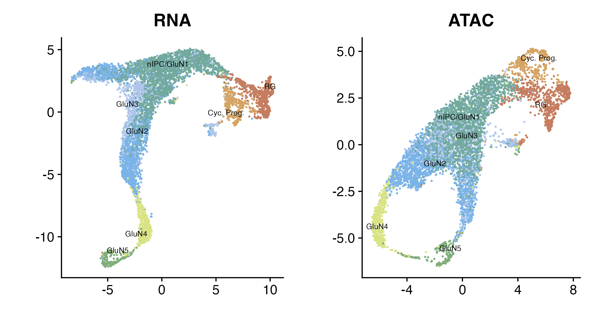
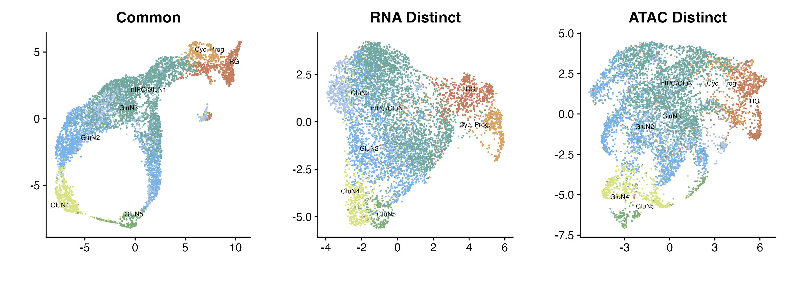

```{r, include = FALSE}
knitr::opts_chunk$set(
  collapse = TRUE,
  comment = "#>"
)
```

```{r, eval = F}
library(Seurat)
library(Signac)
library(tiltedCCA)
library(cowplot)
library(MASS)
set.seed(10)
```

We go through how to analyze single-cell multiomic data in this vignette (RNA and ATAC). We focus on a 10x Multiome data from [Trevino et al., Cell, 2021](https://pubmed.ncbi.nlm.nih.gov/34390642/), which can be downloaded directly from [their GitHub](https://github.com/GreenleafLab/brainchromatin). Relevant citation:
```
Trevino, A. E., Müller, F., Andersen, J., Sundaram, L., Kathiria, A., Shcherbina, A., ... & Greenleaf, W. J. (2021). Chromatin and gene-regulatory dynamics of the developing human cerebral cortex at single-cell resolution. Cell, 184(19), 5053-5069.
```

# Preliminary analysis

We will work from a simplified preprocessed version of the data, already compiled as a Seurat object, which you can download from [https://www.dropbox.com/s/gh2om9eb5edgi14/10x_trevino_simplified.RData](https://www.dropbox.com/s/gh2om9eb5edgi14/10x_trevino_simplified.RData) (about 0.34 Gigabytes in size). To make the data more portable, important biological information (not relevant to our Tilted-CCA analysis in this vignette) is discarded. Please refer to our [original preprocessing script](https://github.com/linnykos/tiltedCCA_analysis/blob/master/main/greenleaf_preprocess.R) to see how to preprocess the data with the full biological information.

## Loading the data

After downloading the file from [the Dropbox link](https://www.dropbox.com/s/gh2om9eb5edgi14/10x_trevino_simplified.RData), load it into your R session.

```{r, eval = F}
load("10x_trevino_simplified.RData")
seurat_obj
#> An object of class Seurat 
#> 271643 features across 6158 samples within 2 assays 
#> Active assay: SCT (2027 features, 2027 variable features)
#>  1 layer present: data
#>  1 other assay present: ATAC
```
This data has 6361 cells with 2027 genes and 269616 peaks.

If we look at metadata, we see that the cell types are also provided (6 cell types in total).
```{r, eval = F}
table(seurat_obj$celltype)
#>  Cyc. Prog.      GluN2      GluN3      GluN4      GluN5 nIPC/GluN1         RG 
#>         341       1546        798        459        223       2348        646
```

We need now preprocess the data using a typical procedure. While the data provided in this vignette is already normalized (RNA via SCTransform, and ATAC via the typical Signac pipeline), we need to compute the embeddings.

```{r, eval = F}
set.seed(10)
Seurat::DefaultAssay(seurat_obj) <- "SCT"
seurat_obj <- Seurat::ScaleData(seurat_obj)
seurat_obj <- Seurat::RunPCA(seurat_obj, 
                             verbose = FALSE)
seurat_obj <- Seurat::RunUMAP(seurat_obj, 
                              dims = 1:50, 
                              reduction.name = "umap.rna", 
                              reduction.key = "rnaUMAP_")

set.seed(10)
seurat_obj <-  Signac::RunSVD(seurat_obj)  
seurat_obj <- Seurat::RunUMAP(seurat_obj,
                              reduction = "lsi", 
                              dims = 2:50, 
                              reduction.name = "umap.atac", 
                              reduction.key = "atacUMAP_")

seurat_obj <- tiltedCCA::rotate_seurat_embeddings(
  seurat_obj = seurat_obj,
  source_embedding = "umap.rna",
  target_embedding = "umap.atac"
)
```

```{r, eval = F}
col_palette <- c(
  "Cyc. Prog." = rgb(213, 163, 98, maxColorValue = 255),
  "GluN2" = rgb(122, 179, 232, maxColorValue = 255),
  "GluN3"= rgb(174, 198, 235, maxColorValue = 255),
  "GluN4" = rgb(217, 227, 132, maxColorValue = 255),
  "GluN5" = rgb(127, 175, 123, maxColorValue = 255),
  "nIPC/GluN1" = rgb(114, 169, 158, maxColorValue = 255),
  "RG" = rgb(197, 125, 95, maxColorValue = 255)
)


p1 <- Seurat::DimPlot(seurat_obj, 
                      reduction = "umap.rna",
                      group.by = "celltype", 
                      cols = col_palette, 
                      label = T, repel = T, label.size = 2.5)
p1 <- p1 + Seurat::NoLegend()
p1 <- p1 + ggplot2::ggtitle("RNA") + ggplot2::labs(x = "", y = "")
p1 <- p1 + ggplot2::theme(legend.text = ggplot2::element_text(size = 5))

p2 <- Seurat::DimPlot(seurat_obj, 
                      reduction = "umap.atac",
                      group.by = "celltype", 
                      cols = col_palette, 
                      label = T, repel = T, label.size = 2.5)
p2 <- p2 + Seurat::NoLegend()
p2 <- p2 + ggplot2::ggtitle("ATAC") + ggplot2::labs(x = "", y = "")
p2 <- p2 + ggplot2::theme(legend.text = ggplot2::element_text(size = 5))

p_all <- cowplot::plot_grid(p1, p2, ncol = 2)
p_all
```

```{r, out.width = "800px", fig.align="center", echo = FALSE, fig.cap=c("UMAPs of the RNA modality (left) and ATAC modality (right)")}

```

# Running Tilted-CCA

We are now ready to run Tilted-CCA.

## Extracting the relevant matrices

We now extract the relevant matrices for Tilted-CCA.
Since Tilted-CCA is designed not necessarily for single-cell data, we don't pass the Seurat object directly into Tilted-CCA.
Instead, we extract the relevant matrices, where the rows are the cells and the columns are various features (i.e., genes and antibodies). We also remove features that has negligible empirical standard deviation. (In this tutorial, no genes or antibodies were removed in this step.)
We end up with `mat_1b` that has 30,672 cells and 2000 genes,
and `mat_2b` that has the same 30,672 cells and 25 surface antibody markers.

```{r, eval = F}
Seurat::DefaultAssay(seurat_obj) <- "SCT"
mat_1 <- Matrix::t(seurat_obj[["SCT"]]@data)
Seurat::DefaultAssay(seurat_obj) <- "ATAC"
mat_2 <- Matrix::t(seurat_obj[["ATAC"]]@data)

mat_1b <- mat_1
sd_vec <- sparseMatrixStats::colSds(mat_1b)
if(any(sd_vec <= 1e-6)){
  mat_1b <- mat_1b[,-which(sd_vec <= 1e-6)]
}

mat_2b <- mat_2
sd_vec <- sparseMatrixStats::colSds(mat_2b)
if(any(sd_vec <= 1e-6)){
  mat_2b <- mat_2b[,-which(sd_vec <= 1e-6)]
}
```

## Running Tilted-CCA

We start Tilted-CCA by first preparing all the low-dimensional embeddings via `tiltedCCA::create_multiSVD`. Most of the boolean arguments are meant to tell our method on whether or not features are centered and/or scaled (or alternatively, the singular vectors are centered and/or scaled). We would recommend the boolean parameters here for any single-cell multiomic data that measures RNA and antibodies.

```{r, eval = F}
set.seed(10)
multiSVD_obj <- tiltedCCA::create_multiSVD(mat_1 = mat_1b, mat_2 = mat_2b,
                                           dims_1 = 1:50, dims_2 = 2:50,
                                           center_1 = T, center_2 = F,
                                           normalize_row = T,
                                           normalize_singular_value = T,
                                           recenter_1 = F, recenter_2 = T,
                                           rescale_1 = F, rescale_2 = T,
                                           scale_1 = T, scale_2 = F,
                                           verbose = 1)
```

We then go to the next step of `tiltedCCA:::form_metacells`. To make this tutorial be more portable, we downscale the calculation to only involve 100 metacells. However, since the UMAPs display a continuous transition of cell states, we do not need to pass any hard clustering information.

```{r, eval = F}
multiSVD_obj <- tiltedCCA::form_metacells(input_obj = multiSVD_obj,
                                          large_clustering_1 = NULL, 
                                          large_clustering_2 = NULL, 
                                          num_metacells = 100,
                                          verbose = 1)
```

This next step, using `tiltedCCA::compute_snns`, is arguably the most subjective step of Tilted-CCA, but nonetheless can dramatically impact the results if not chosen with care. Here:

- `latent_k` dictates how many latent dimensions are extracted from the Laplacian bases of the shared nearest neighbor graphs
- `num_neigh` dictates how many nearest neighbors are used for each cell when constructing the nearest neighbor graphs
- `bool_cosine` dictates if distance between cells is based on the cosine distance (if `TRUE`, i.e., Euclidean distance after normalizing each gene's low-dimensional embedding to have Euclidean length 1) or Euclidean distance (if `FALSE`)
- `bool_intersect` dictates if an edge is placed between two cells only if each cell is a nearest neighbor of the other cell (if `TRUE`) or if an edge is placed between two cells as long as one cell is a nearest neighbor of the other cell (if `FALSE`)
- `min_deg` dictates the smallest number of edges for each cell (which is only relevant if `bool_intersect=TRUE`), and this value should be a value smaller or equal to `num_neigh`

```{r, eval = F}
multiSVD_obj <- tiltedCCA::compute_snns(input_obj = multiSVD_obj,
                                        latent_k = 20,
                                        num_neigh = 15,
                                        bool_cosine = T,
                                        bool_intersect = F,
                                        min_deg = 15,
                                        verbose = 1)
```

Then, we initialize the tilt for all 49 latent dimensions (i.e., the minimum between the number of latent dimensions in `dims_1` and `dims_2`) via `tiltedCCA::tiltedCCA`.

```{r, eval = F}
multiSVD_obj2 <- tiltedCCA::tiltedCCA(input_obj = multiSVD_obj,
                                      verbose = 1)
```

Finally, we fine tune the tilt of each latent dimension. This step can take a while. On a 2023 Macbook Pro (Sonoma, Apple M2 Max with 32 Gb of memory), this step takes around 20 minutes. 

```{r, eval = F}
multiSVD_obj2 <- tiltedCCA::fine_tuning(input_obj = multiSVD_obj2,
                                        verbose = 1)
```


<details>
<summary>**Results of fine tuning**</summary>

The `tiltedCCA:::fine_tuning` essentially sets the appropriate tilts per latent dimension, stored in `multiSVD_obj$tcca_obj$tilt_perc`. 
If you want to directly, you can directly set the desired tilts using the `fix_tilt_perc` argument in `tiltedCCA:::fine_tuning`.
For example, we can run the following code:

```{r, eval = F}
desired_tilt <- c(0.65, 0.85, 0.55, 1.00, 1.00, 0.95,
                  1.00, 1.00, 1.00, 1.00, 1.00, 1.00,
                  0.40, 0.10, 0.70, 0.15, 0.75, 0.00,
                  0.00, 0.45, 0.15, 0.05, 0.80, 0.95,
                  0.65, 0.40, 0.45, 0.40, 0.75, 1.00,
                  0.80, 0.10, 0.00, 0.30, 0.65, 0.05,
                  0.65, 0.85, 0.35, 1.00, 0.85, 0.25,
                  0.90, 0.30, 0.40, 0.95, 0.30, 0.55,
                  0.65)
multiSVD_obj3 <- tiltedCCA::tiltedCCA(input_obj = multiSVD_obj,
                                      fix_tilt_perc = desired_tilt,
                                      verbose = 1)
```

We can then use `multiSVD_obj3` for the rest of the tutorial, instead of `multiSVD_obj2`.

</details>

After running `tiltedCCA:fine_tuning`, it is recommended to save `multiSVD_obj2` since this was the most expensive calculation (in terms of computation time). The last function call simply takes the tilts of each latent dimension to compute the full decomposition of each modality (i.e., cell by feature matrix), four in total (i.e., a common and distinct for each RNA and ADT). While this function doesn't take too much computation time, it greatly expands the memory size of the `multiSVD_obj2` object.

```{r, eval = F}
multiSVD_obj2 <- tiltedCCA::tiltedCCA_decomposition(input_obj = multiSVD_obj2,
                                                    verbose = 1,
                                                    bool_modality_1_full = T,
                                                    bool_modality_2_full = F)
```

# Downstream analysis of Tilted-CCA

Congratulations! You have computed the common and distinct embeddings for the single-cell multiomic data. There are various downstream diagnostics you can apply.

## Visualizing the common and distinct embeddings

```{r, eval = F}
set.seed(10)
seurat_obj[["common_tcca"]] <- tiltedCCA::create_SeuratDim(input_obj = multiSVD_obj2,
                                                           what = "common",
                                                           aligned_umap_assay = "rna.umap",
                                                           seurat_obj = seurat_obj,
                                                           seurat_assay = "SCT",
                                                           verbose = 1)
set.seed(10)
seurat_obj[["distinct1_tcca"]] <- tiltedCCA::create_SeuratDim(input_obj = multiSVD_obj2,
                                                              what = "distinct_1",
                                                              aligned_umap_assay = "rna.umap",
                                                              seurat_obj = seurat_obj,
                                                              seurat_assay = "SCT",
                                                              verbose = 1)
set.seed(10)
seurat_obj[["distinct2_tcca"]] <- tiltedCCA::create_SeuratDim(input_obj = multiSVD_obj2,
                                                              what = "distinct_2",
                                                              aligned_umap_assay = "rna.umap",
                                                              seurat_obj = seurat_obj,
                                                              seurat_assay = "SCT",
                                                              verbose = 1)
```

```{r, eval = F}
p1 <- Seurat::DimPlot(seurat_obj, 
                      reduction = "common_tcca",
                      group.by = "celltype", 
                      cols = col_palette, 
                      label = T, repel = T, label.size = 2.5)
p1 <- p1 + Seurat::NoLegend()
p1 <- p1 + ggplot2::ggtitle("Common") + ggplot2::labs(x = "", y = "")
p1 <- p1 + ggplot2::theme(legend.text = ggplot2::element_text(size = 5))

p2 <- Seurat::DimPlot(seurat_obj, 
                      reduction = "distinct1_tcca",
                      group.by = "celltype", 
                      cols = col_palette, 
                      label = T, repel = T, label.size = 2.5)
p2 <- p2 + Seurat::NoLegend()
p2 <- p2 + ggplot2::ggtitle("RNA Distinct") + ggplot2::labs(x = "", y = "")
p2 <- p2 + ggplot2::theme(legend.text = ggplot2::element_text(size = 5))

p3 <- Seurat::DimPlot(seurat_obj, 
                      reduction = "distinct2_tcca",
                      group.by = "celltype", 
                      cols = col_palette, 
                      label = T, repel = T, label.size = 2.5)
p3 <- p3 + Seurat::NoLegend()
p3 <- p3 + ggplot2::ggtitle("ATAC Distinct") + ggplot2::labs(x = "", y = "")
p3 <- p3 + ggplot2::theme(legend.text = ggplot2::element_text(size = 5))

p_all <- cowplot::plot_grid(p1, p2, p3, ncol = 3)
p_all
```

```{r, out.width = "800px", fig.align="center", echo = FALSE, fig.cap=c("Common, RNA distinct, and ATAC distinct embeddings")}

```