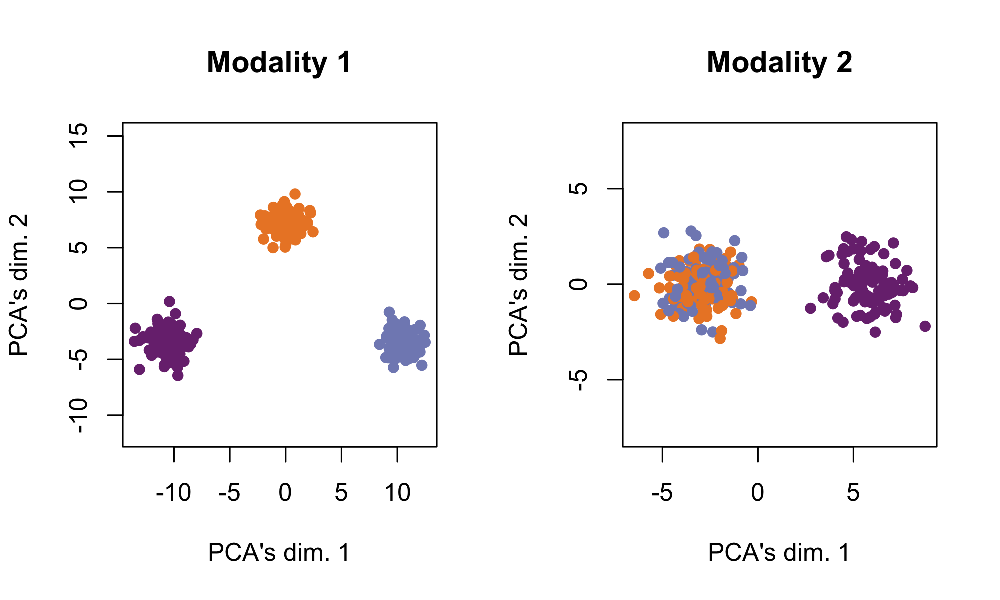
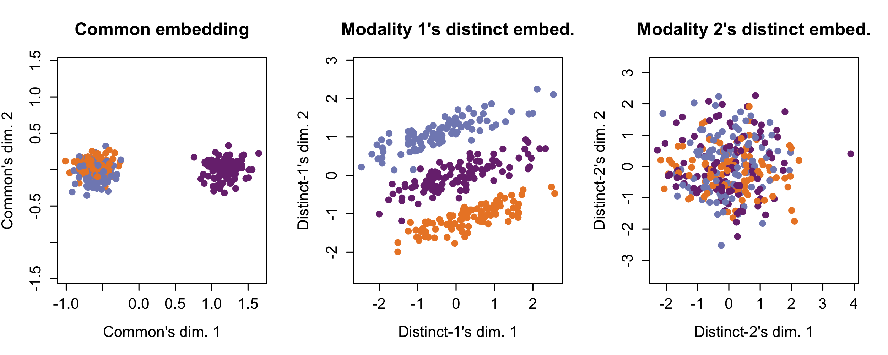
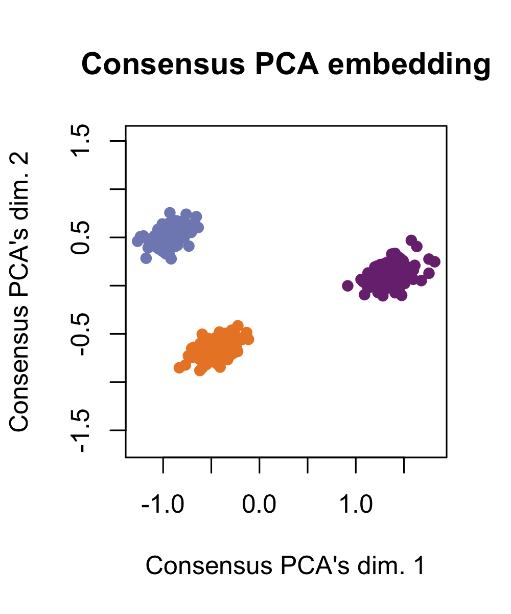
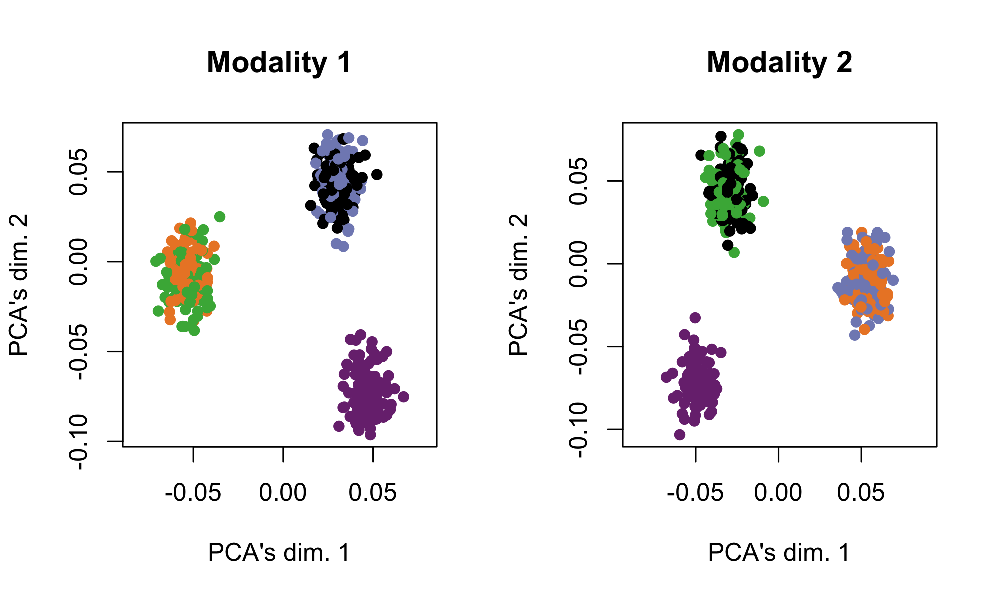
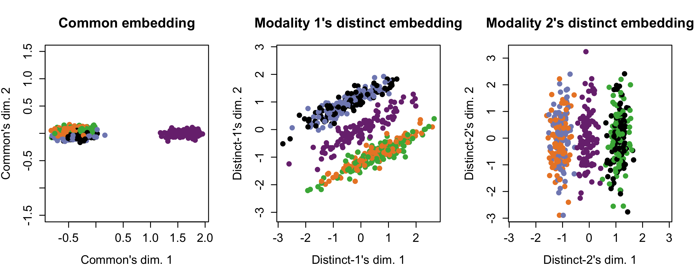
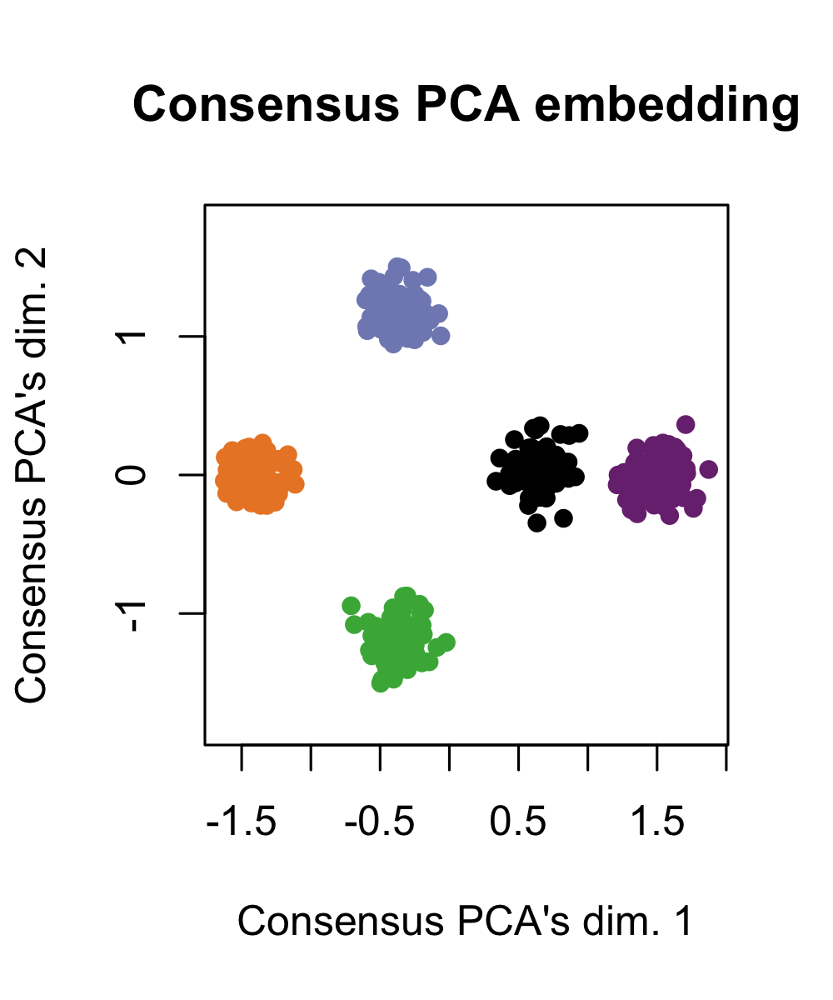

```{r, include = FALSE}
knitr::opts_chunk$set(
  collapse = TRUE,
  comment = "#>"
)
```

# Purpose

The simulations here are meant to be portable, toy-examples of Tilted-CCA, with the intent to demonstrate that an installation of Tilted-CCA was successful as well as to demonstrate how it differs from the methods that seek to find the "union of information".

A successful installation of `tiltedCCA` is required for this. See the 
last section of this README of all the system/package dependencies used when creating these simulations. Both simulations should complete in less than 2 minutes.

# Overview

Broadly speaking, Tilted-CCA is a pipeline of 6 different function calls. The procedure starts by assuming there are two data matrices, `mat_1` and `mat_2`, (either `matrix` or `dgCMatrix`) with the same number of rows (i.e., the same cells), but possibly different features. We advise making sure each row/column of either matrix has non-zero variance prior to using this pipeline.

* **Step 1 (Initializing low-rank representation of each modality, `create_multiSVD`):** We compute the leading PCs of each modality here. There can be a different number of latent dimensions for each modality. Here, the additional parameters dictate how to compute the leading PCs (for example, should the features be scaled/center before or after the computing the PCs? Which PCs should be used downstream? This would be useful since for ATAC data, it is common to not use the first leading PC.)

This typically looks like the following.
```{r, eval=FALSE}
multiSVD_obj <- tiltedCCA::create_multiSVD(mat_1 = mat_1, mat_2 = mat_2,
                                            dims_1 = 1:2, dims_2 = 1:2,
                                            center_1 = F, center_2 = F,
                                            normalize_row = T,
                                            normalize_singular_value = F,
                                            recenter_1 = F, recenter_2 = F,
                                            rescale_1 = F, rescale_2 = F,
                                            scale_1 = F, scale_2 = F)
```

The output of this step is a `multiSVD` object, which will continually be updated as we feed it as input and get an updated object after each of the following function calls. It currently has elements `svd_1`, `svd_2`, `default_assay`, and `param`. 

* **Step 2 (Passing helping information, `form_metacells`):** We pass (optional) large clustering structure or meta-cells here. The former is designed to help aid Tilted-CCA assess what the "intersection of information" is, and the latter is designed for handling large datasets with more than 10,000 cells. If no large structuring structure is needed, the practitioner can simply pass in `large_clustering_1=NULL` and `large_clustering_2=NULL`. If no meta-cells are needed, the practitioner can simply pass in `num_metacells=NULL`.


This typically looks like the following.
```{r, eval=FALSE}
multiSVD_obj <- tiltedCCA::form_metacells(input_obj = multiSVD_obj,
                                           large_clustering_1 = clustering_1, 
                                           large_clustering_2 = clustering_2,
                                           num_metacells = NULL)
```

The updated `multiSVD` object will now have an additional element: `metacell_obj`.

* **Step 3 (Creating shared nearest neighbor (SNN) graphs, `compute_snns`):** We compute the SNN graphs for both modalities and the target common manifold (computed based on both modality's SNN graph). These graphs dictate how Tilted-CCA represents the information in each modality, and each node of the graph represents a cell/meta-cell. Here, the additional parameters dictate the specific details on how these graphs are constructed. The two important parameters `latent_k` (i.e., the dimensionality of the graph Laplacian eigenbases, which is used when optimizing the tilt) and `num_neigh` (i.e., the number of neighbors for each cell in either modality).

This typically looks like the following.
```{r, eval=FALSE}
multiSVD_obj <- tiltedCCA::compute_snns(input_obj = multiSVD_obj,
                                         latent_k = 2,
                                         num_neigh = 10,
                                         bool_cosine = T,
                                         bool_intersect = T,
                                         min_deg = 1)
```

The updated `multiSVD` object will now have additional elements: `snn_list` and `laplacian_list`.

* **Step 4 (Initializing Tilted-CCA, `tiltedCCA`):** We compute the CCA between both modalities and initialize the tilt across all latent dimensions to a particular value. Recall that CCA's solution can be directly computed using the PC's from each modality. If there are different number of latent dimensions for each modality, Tilted-CCA will have a latent dimensionality (i.e., via CCA) equal to the smaller of the two.

```{r, eval=FALSE}
multiSVD_obj <- tiltedCCA::tiltedCCA(input_obj = multiSVD_obj)
```

The updated `multiSVD` object will now have additional elements: `cca_obj` and `tcca_obj`.

* **Step 5 (Tuning the tilt across each latent dimension, `fine_tuning`):** We tune the tilt across each latent dimension. This is the main computational bottleneck of Tilted-CCA, as an optimization is performed cyclically (i.e., the tilt for each latent dimension is updated in sequence, with a few epochs cycling through all latent dimensions). 

```{r, eval=FALSE}
multiSVD_obj <- tiltedCCA::fine_tuning(input_obj = multiSVD_obj)
```

There is no new obvious element added to `multiSVD`, but the representation of the common and distinct embeddings is updated upon this function's completion. For example, `multiSVD_obj$tcca_obj$tilt_perc` now is a vector, denoting the tilt of the common vector for each latent dimension.

* **Step 6 (Completing the decomposition, `tiltedCCA_decomposition`):** Given the tilts of common vectors across all latent dimensions, we now recover the full cell-by-feature decomposition of each modality. Here, the additional parameters dictate whether you want the decompositions to be cell-by-feature or cell-by-PC. The latter is desirable especially if you are analyzing ATAC data, where the cell-by-feature would be a dense matrix with many hundred-of-thousand features (which would be too memory intensive).

```{r, eval=FALSE}
multiSVD_obj <- tiltedCCA::tiltedCCA_decomposition(multiSVD_obj)
```

The updated `multiSVD` object will now have additional elements: `common_mat_1` and `distint_mat_1` (or `common_dimred_1` and `distinct_dimred_1` if `bool_modality_1_full=F`)
and `common_mat_2` and `distint_mat_2` (or `common_dimred_2` and `distinct_dimred_2` if `bool_modality_2_full=F`)

## Simulation 1: Modality 1 separates cells into 3 clusters, and Modality 2 does not

See https://github.com/linnykos/tiltedCCA_analysis/blob/master/simulation/simulation_1.R for this simulation. In this simulation, there are 300 cells across two modalities of 10 features each. Modality 1 has a "high" amount of distinct information -- it separates the 300 cells into 3 obvious clusters. Modality 2 has a "low" amount of distinct information -- all 300 cells are in one amorphous ball.

The following shows each modality based on their leading 2 PCs respectively, where the cells are colored by the true cell-types.

```{r, out.width = "600px", fig.align="center", echo = FALSE, fig.cap=c("simulation1_data")}

```

The following shows Tilted-CCA's common (i.e., shared axes of variation between both modalities) and distinct (i.e., axes of variation unique to a modality, after the common axes have been accounted for) axes of variation, where the cells are colored by the true cell-types. Here, observe that the common embedding does not really contain information to separate the cell-types -- this is desirable, as all the cell-type separation information are unique to Modality 1 (hence, appearing in the Modality 1's distinct embedding). The common embedding demonstrates the "intersection of information."

```{r, out.width = "650px", fig.align="center", echo = FALSE, fig.cap=c("simulation1_tcca")}

```

In contrast with Tilted-CCA's "intersection of information," we demonstrate Consensus PCA, which is a prototypical method illustrating the "union of information" where a low-dimensional embedding is constructed for multimodal data by combining the leading axes of variation from each modality.
These embeddings are useful to visualize the "best of both worlds" (i.e., having cell-type separation that best combines both modalities), but is not useful for to understand the shared and distinct signals between the two modalities. Here, observe that the three cell-types are clearly separated by Consensus PCA.

```{r, out.width = "300px", fig.align="center", echo = FALSE, fig.cap=c("simulation1_consensuspca")}

```

## Simulation 2: Both modalities separate the 5 cell-types into 3 clusters in different ways

See https://github.com/linnykos/tiltedCCA_analysis/blob/master/simulation/simulation_2.R for this simulation. In this simulation, there are 500 cells across two modalities of 10 features each. There are 5 true cell-types, but each modality can only differentiate these cell-types into 3 clusters. Modality 1 separates the cyan cells from the red+black cells from the green+blue cells,
while Modality 2 separates the cyan cells from the red+blue cells from the green+black cells.

The following shows each modality based on their leading 2 PCs respectively, where the cells are colored by the true cell-types.

```{r, out.width = "600px", fig.align="center", echo = FALSE, fig.cap=c("simulation2_data")}

```

The following shows Tilted-CCA's common (demonstrating the "intersection of information") and distinct axes of variation, where the cells are colored by the true cell-types. Here, observe that the common embedding shows the information that both modalities agree upon -- the cyan cells are separable from all other cell-types. The distinct information then illustrates what is distinct for each modality: Modality 1 separates the cyan cells from the red+black cells from the green+blue cells,
while Modality 2 separates the cyan cells from the red+blue cells from the green+black cells.

```{r, out.width = "650px", fig.align="center", echo = FALSE, fig.cap=c("simulation2_tcca")}

```

Consensus PCA for this data cleanly separates all five cell-types. Again, quantifying "union of information" is a useful and complementary perspective to what Tilted-CCA does. The "union" gives perspective on what axes of variation are contained across both modalities, while Tilted-CCA's common embeddings gives perspective on what axes of variation are shared between both modalities.

```{r, out.width = "300px", fig.align="center", echo = FALSE, fig.cap=c("simulation2_consensuspca")}

```

# Setup

The following shows the suggested package versions that the developer (GitHub username: linnykos) used when developing the Tilted-CCA package.

```R
> devtools::session_info()
─ Session info ─────────────────────────────────────────────────────
 setting  value
 version  R version 4.1.2 (2021-11-01)
 os       Red Hat Enterprise Linux
 system   x86_64, linux-gnu
 ui       X11
 language (EN)
 collate  en_US.UTF-8
 ctype    en_US.UTF-8
 tz       America/New_York
 date     2022-10-04
 pandoc   1.12.3.1 @ /usr/bin/pandoc

─ Packages ────────────────────────
 package           * version   date (UTC) lib source
 cachem        1.0.6      2021-08-19 [1] CRAN (R 4.1.2)
 callr         3.7.1      2022-07-13 [1] CRAN (R 4.1.2)
 cli           3.3.0      2022-04-25 [1] CRAN (R 4.1.2)
 crayon        1.5.1      2022-03-26 [1] CRAN (R 4.1.2)
 devtools      2.4.4      2022-07-20 [1] CRAN (R 4.1.2)
 digest        0.6.29     2021-12-01 [1] CRAN (R 4.1.2)
 ellipsis      0.3.2      2021-04-29 [1] CRAN (R 4.1.2)
 fastmap       1.1.0      2021-01-25 [1] CRAN (R 4.1.2)
 fs            1.5.2      2021-12-08 [1] CRAN (R 4.1.2)
 glue          1.6.2      2022-02-24 [1] CRAN (R 4.1.2)
 htmltools     0.5.3      2022-07-18 [1] CRAN (R 4.1.2)
 htmlwidgets   1.5.4      2021-09-08 [1] CRAN (R 4.1.2)
 httpuv        1.6.5      2022-01-05 [1] CRAN (R 4.1.2)
 later         1.3.0      2021-08-18 [1] CRAN (R 4.1.2)
 lifecycle     1.0.1      2021-09-24 [1] CRAN (R 4.1.2)
 magrittr      2.0.3      2022-03-30 [1] CRAN (R 4.1.2)
 memoise       2.0.1      2021-11-26 [1] CRAN (R 4.1.2)
 mime          0.12       2021-09-28 [1] CRAN (R 4.1.2)
 miniUI        0.1.1.1    2018-05-18 [1] CRAN (R 4.1.2)
 pkgbuild      1.3.1      2021-12-20 [1] CRAN (R 4.1.2)
 pkgload       1.3.0      2022-06-27 [1] CRAN (R 4.1.2)
 prettyunits   1.1.1      2020-01-24 [1] CRAN (R 4.1.2)
 processx      3.7.0      2022-07-07 [1] CRAN (R 4.1.2)
 profvis       0.3.7      2020-11-02 [1] CRAN (R 4.1.2)
 promises      1.2.0.1    2021-02-11 [1] CRAN (R 4.1.2)
 ps            1.7.0      2022-04-23 [1] CRAN (R 4.1.2)
 purrr         0.3.4      2020-04-17 [1] CRAN (R 4.1.2)
 R6            2.5.1      2021-08-19 [1] CRAN (R 4.1.2)
 Rcpp          1.0.9      2022-07-08 [1] CRAN (R 4.1.2)
 remotes       2.4.2      2021-11-30 [1] CRAN (R 4.1.2)
 rlang         1.0.4      2022-07-12 [1] CRAN (R 4.1.2)
 sessioninfo   1.2.2      2021-12-06 [1] CRAN (R 4.1.2)
 shiny         1.7.2      2022-07-19 [1] CRAN (R 4.1.2)
 stringi       1.7.8      2022-07-11 [1] CRAN (R 4.1.2)
 stringr       1.4.0      2019-02-10 [1] CRAN (R 4.1.2)
 tiltedCCA   * 1.0.0.001  2022-09-06 [1] local
 urlchecker    1.0.1      2021-11-30 [1] CRAN (R 4.1.2)
 usethis       2.1.6      2022-05-25 [1] CRAN (R 4.1.2)
 xtable        1.8-4      2019-04-21 [1] CRAN (R 4.1.2)
```
